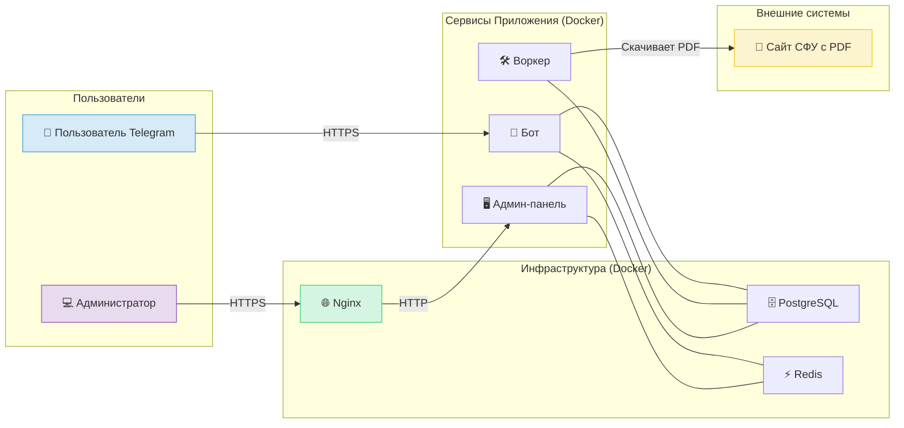

# Telegram-бот для абитуриентов ИНиГ СФУ ("Огонёк")

## 1. О проекте

**"Огонёк"** — это full-stack проект, разработанный для автоматизации работы приемной комиссии и упрощения жизни абитуриентов. Бот предоставляет мгновенный доступ к актуальным конкурсным спискам и ключевой информации об институте, избавляя от необходимости вручную искать данные в сложных PDF-документах.

**Статус проекта:** Проект успешно прошел пилотный запуск в рамках приемной кампании 2025 года.

---
## 2. Демонстрация работы

<table align="center" style="border: none; margin: 0 auto;">
  <tr style="background-color: transparent;">
    <td align="center" style="border: none; padding: 10px;">
      
<strong>Основной сценарий: Поиск в списках</strong>

      
    </td>
    <td align="center" style="border: none; padding: 10px;">
      
<strong>Пример вывода информации</strong>

      
    </td>
  </tr>
  <tr style="background-color: transparent;">
    <td colspan="2" align="center" style="border: none; padding: 10px;">
      
<strong>Навигация по информационным разделам</strong>

      
    </td>
  </tr>
</table>

---

## 3. Решаемая проблема

Перед абитуриентами стояла проблема "информационного барьера":
*   **Сложный поиск:** Необходимость вручную скачивать многостраничные PDF-файлы и искать в них свой СНИЛС, что особенно неудобно с мобильных устройств.
*   **Отсутствие контекста:** Статичный PDF-файл не дает ответа на главный вопрос: "Каковы мои реальные шансы?".
*   **"Черный ящик" для Института:** Отсутствие какой-либо аналитики о том, насколько востребована информация в конкурсных списках.

---

## 4. Архитектура и технические решения

Проект построен на отказоустойчивой микросервисной архитектуре, полностью обернутой в Docker и развернутой на облачной платформе Yandex.Cloud.

*   **`Bot` (Python, Aiogram):** Основной сервис, отвечающий за взаимодействие с пользователем в Telegram.
*   **`Worker` (Python, APScheduler):** Фоновый сервис для выполнения ресурсоемких задач: регулярный парсинг PDF-файлов с сайта университета с помощью `Tabula-py`.
*   **`Admin Panel` (Python, FastAPI):** Веб-приложение (TWA) для администраторов, предоставляющее доступ к статистике и управлению.
*   **`Database` (PostgreSQL):** Хранение всех данных о пользователях, конкурсных списках и логах.
*   **`Cache` (Redis):** Используется для кеширования часто запрашиваемых данных и хранения FSM-состояний.
*   **`Reverse Proxy` (Nginx):** Обеспечивает HTTPS-доступ к админ-панели.
*   **Развертывание:** Все сервисы запускаются и управляются через Docker Compose на виртуальном сервере в **Yandex.Cloud**.

---

## 5. Технологический стек

*   **Языки:** Python, SQL
*   **Фреймворки и Технологии:** Aiogram, FastAPI, SQLAlchemy, Docker, Docker Compose, Git, Nginx
*   **СУБД:** PostgreSQL
*   **Инструменты и Платформы:** Yandex.Cloud, Redis
